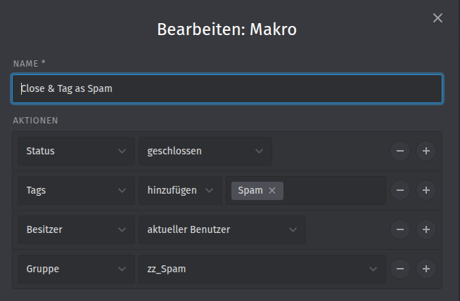
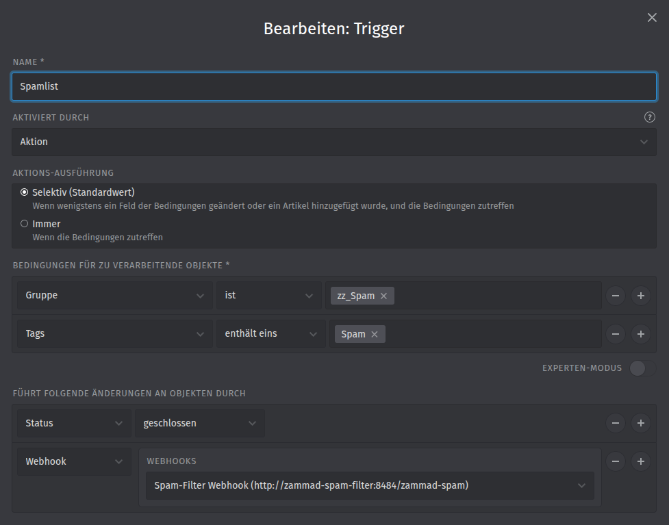

# Zammad Spam Filter

🇩🇪 [Deutsche Version](README.de.md)

A small webhook service for [Zammad](https://zammad.org): when an agent marks a ticket as spam, the service automatically creates a **postmaster filter** for the sender. Future mails from that sender land **closed in the group `zz_Spam`** with the tag `Spam-Auto` – out of the regular overviews, but still searchable.

Mails are deliberately **not** discarded (`x-zammad-ignore`). Otherwise, a single misclick on "spam" would silently drop all future mail from a legitimate sender without anyone noticing.

## How it works

```
Agent applies macro "Close & Tag as Spam"
  → ticket: group zz_Spam, tag Spam, closed
  → trigger "Spamlist" fires (once)
  → webhook POST http://zammad-spam-filter:8484/zammad-spam
  → service creates postmaster filter "Spam-Block: <sender>"

New mail from the same sender
  → postmaster filter matches
  → new ticket: group zz_Spam, closed, tag Spam-Auto
  → trigger does NOT fire (tag is Spam-Auto, not Spam)
```

The created filter looks like this:

```json
{
  "name": "Spam-Block: spammer@example.com",
  "match":   { "from": { "operator": "contains", "value": "spammer@example.com" } },
  "perform": {
    "x-zammad-ticket-group_id": { "value": "<SPAM_GROUP_ID>" },
    "x-zammad-ticket-state_id": { "value": "<SPAM_STATE_ID>" },
    "x-zammad-ticket-tags":     { "operator": "add", "value": "Spam-Auto" }
  },
  "channel": "email",
  "active": true
}
```

If a filter with that name already exists, the service does not create a second one.

## Setup in Zammad

Follow the steps in this order – the webhook (step 5) requires the container to be running already. The screenshots show the German Zammad UI.

### 1. Create the group `zz_Spam`

*Admin → Groups → New Group*

- **Name:** `zz_Spam` (the `zz_` prefix sorts the group to the end of lists)
- **Access:** only the agents who should review spam occasionally. Everyone else won't see these tickets at all.

Tip: agents with access should deselect the group `zz_Spam` in their notification settings so they don't get emails for automatically sorted spam.

### 2. Create the tags `Spam` and `Spam-Auto`

*Admin → Tags*

Create both tags if only admins are allowed to create new tags:

| Tag | set by | meaning |
|---|---|---|
| `Spam` | macro (manually by an agent) | triggers the webhook |
| `Spam-Auto` | postmaster filter (automatically) | triggers **nothing** |

The separation matters: if the filter also set `Spam`, every blocked mail would call the webhook again.

### 3. Create an API token

We recommend a dedicated technical user (e.g. `spamfilter@…`) with its own role that has only these permissions:

- `admin.channel_email` – to read and create postmaster filters
- `user_preferences.access_token` – so the user can create a token

Log in as that user, go to *Profile → Token Access → Create*, and select the permission **`admin.channel_email`**. Put the token into `.env` as `ZAMMAD_SPAMFILTER_API_TOKEN`.

The token does **not** need access to groups or ticket states – that's why their IDs are passed via environment variables (next step).

### 4. Look up the group and state IDs

On the Zammad server:

```bash
docker compose exec zammad-railsserver bundle exec rails r \
  'puts "Group: #{Group.find_by(name: "zz_Spam").id}"; puts "State: #{Ticket::State.find_by(name: "closed").id}"'
```

Put the values into `.env` as `ZAMMAD_SPAMFILTER_GROUP_ID` and `ZAMMAD_SPAMFILTER_STATE_ID`. In a default installation, the state `closed` has ID `4`.

Then start the container (see [Installation](#installation)).

### 5. Create the webhook

*Admin → Webhook → New Webhook*

| Field | Value |
|---|---|
| Name | `Spam-Filter Webhook` |
| Endpoint | `http://zammad-spam-filter:8484/zammad-spam` |
| Request method | `POST` |
| SSL verification | no (internal HTTP connection inside the Docker network) |
| Authentication | optional *Bearer token* – then put the same value into `.env` as `ZAMMAD_SPAMFILTER_WEBHOOK_TOKEN` |
| Custom payload | **off** |

The service reads `ticket.customer.email` from the default payload. If you use a custom payload, keep that field.

### 6. Create the macro "Close & Tag as Spam"

*Admin → Macros → New Macro*

| Action | Value |
|---|---|
| State | closed |
| Tags | add: `Spam` |
| Owner | current user |
| Group | `zz_Spam` |

Agents use this macro to mark a ticket as spam.



### 7. Create the trigger "Spamlist"

*Admin → Triggers → New Trigger*

| Field | Value |
|---|---|
| Name | `Spamlist` |
| Activated by | Action |
| Action execution | **Selective** |
| Condition 1 | Group **is** `zz_Spam` |
| Condition 2 | Tags **contains one** `Spam` |
| Action 1 | State: closed |
| Action 2 | Webhook: `Spam-Filter Webhook` |



**Why exactly like this?**

- **Selective instead of Always:** with "Always", the trigger fires on *every* change to a spam ticket (note, owner change, merge …) and calls the webhook again and again.
- **Condition on the group:** in "Selective" mode, Zammad checks whether a field from the conditions has changed. **Tags do not count as a changed field** – a trigger with only a tag condition never fires in "Selective" mode. The group, however, is a ticket field; the macro moves the ticket to `zz_Spam`, so the trigger fires exactly once.

## Installation

The container must run in the **same Docker network as Zammad** so that Zammad can reach the webhook at `http://zammad-spam-filter:8484`. No public port is needed.

```bash
git clone https://github.com/christophdb/zammad-spam-filter.git
cd zammad-spam-filter
cp .env.example .env
# fill in .env (see steps 3 and 4 above)

docker compose config            # check: are all variables set?
docker compose up -d --build
docker compose logs -f
```

To run the service in an existing `docker-compose.yml` next to Zammad instead, copy the service block and point `build:` to the directory of this repository.

### Environment variables

| Variable in `.env` | Required | Meaning |
|---|---|---|
| `ZAMMAD_URL` | yes | Zammad hostname, **without** `https://` |
| `ZAMMAD_NETWORK` | yes | Docker network Zammad runs in |
| `ZAMMAD_SPAMFILTER_API_TOKEN` | yes | API token with `admin.channel_email` |
| `ZAMMAD_SPAMFILTER_GROUP_ID` | yes | ID of the group `zz_Spam` |
| `ZAMMAD_SPAMFILTER_STATE_ID` | yes | ID of the state `closed` |
| `ZAMMAD_SPAMFILTER_WEBHOOK_TOKEN` | no | bearer token of the webhook; empty = no check |

Inside the container the variables have shorter names (`ZAMMAD_TOKEN`, `SPAM_GROUP_ID`, …), see `docker-compose.yml`. You can also set `SPAM_TAG` there (default: `Spam-Auto`).

### Test

1. Send a mail to Zammad from a test address of your own.
2. Apply the macro "Close & Tag as Spam" to the ticket.
3. `docker compose logs zammad-spam-filter` shows `Neu geblockt: <address>`.
4. Send a second mail from the same address → new ticket, closed, group `zz_Spam`, tag `Spam-Auto`. **No** new call appears in the log.
5. Delete the test filter again (see below).

## Operation

### Undo a misclick

A legitimate sender was marked as spam:

```bash
docker compose exec zammad-railsserver bundle exec rails r \
  'PostmasterFilter.where(name: "Spam-Block: sender@example.com").destroy_all'
```

Then move the affected tickets in `zz_Spam` (tag `Spam-Auto`) to the right group, reopen them and remove the tags.

Check tickets with the tag `Spam-Auto` regularly – legitimate senders there are misclicks.

### Find filters

**The filter list in the Zammad UI shows at most 500 filters** – the oldest ones (see [Known Zammad quirks](#known-zammad-quirks)). Search filters via the Rails console instead:

```bash
docker compose exec zammad-railsserver bundle exec rails r '
PostmasterFilter.select { |f| f.match.to_s.include?("example.com") }
  .each { |f| puts [f.id, f.name, f.active, f.created_at].join(" | ") }
'
```

Count and duplicates:

```bash
docker compose exec zammad-railsserver bundle exec rails r '
puts "Total:      #{PostmasterFilter.count}"
puts "Duplicates: #{PostmasterFilter.group(:name).having("count(*) > 1").count.inspect}"
'
```

### Trace what happened to a mail

```bash
docker compose logs --since 24h zammad-scheduler | grep -i -A5 "<message-id or sender>"
```

The log shows which filter matched (`matching: key 'from' contains '…'`).

## Known Zammad quirks

- **500-entry limit of the filter list:** the admin UI loads postmaster filters via `GET /api/v1/postmaster_filters` without `per_page`. The server then returns only 500 entries ordered by ID (`paginate_with(default: 500)` in `app/controllers/application_controller/renders_models.rb`). Newer filters are invisible in the UI but **still active** – mail processing reads all filters directly from the database. This service fetches all pages. Reported as [zammad/zammad#6404](https://github.com/zammad/zammad/issues/6404).
- **Selective triggers ignore tag changes:** see step 7.
- **IMAP fetching deletes mails:** without "keep messages on server", Zammad deletes every fetched mail from the mail server – even if no ticket is created from it.
- **`rails` in the Docker image:** not in `PATH`, always use `bundle exec rails …`.

## Migrating from `x-zammad-ignore`

Older versions of this service created filters with `x-zammad-ignore`, which discard mails entirely. Existing filters can be converted once. Check with `DRY = true` first, then run with `DRY = false`; adjust the group and state IDs:

```bash
docker compose exec zammad-railsserver bundle exec rails r '
DRY = true
NEW_PERFORM = {
  "x-zammad-ticket-group_id" => { "value" => "5" },
  "x-zammad-ticket-state_id" => { "value" => "4" },
  "x-zammad-ticket-tags"     => { "operator" => "add", "value" => "Spam-Auto" },
}
spam  = PostmasterFilter.where("name LIKE ?", "Spam-Block:%").order(:id).to_a
dupes = spam.group_by { |f| [f.name, f.match] }.values.flat_map { |fs| fs.drop(1) }
conv  = (spam - dupes).select { |f| f.perform.key?("x-zammad-ignore") }
puts "Delete duplicates: #{dupes.size}"
puts "Convert:           #{conv.size}"
unless DRY
  PostmasterFilter.transaction do
    dupes.each(&:destroy)
    conv.each { |f| f.update!(perform: NEW_PERFORM) }
  end
  puts "Done. Total: #{PostmasterFilter.count}"
end
'
```

## Security

- The service is only reachable inside the Docker network (no published port).
- If `ZAMMAD_SPAMFILTER_WEBHOOK_TOKEN` is set, calls without a matching bearer token are rejected with `401`. Without a token, any container in the same network can have senders blocked.
- The webhook's HMAC signature is not verified.
